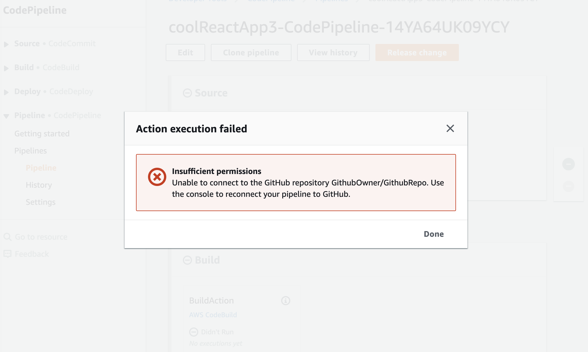
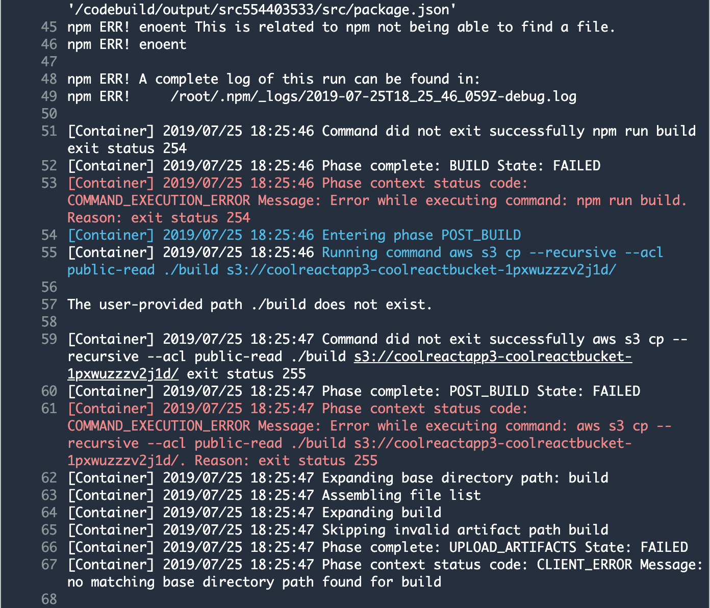

# Debug Build Configs

## Config One: 
Removed the "-" from my s3 bucket name
Had issues with code pipeline running "npm run build". Fixed that by manually moving my package.json and packagelock.json a folder up from where they were before

## Config Two:
Deleted the PackageLock.json file and re-ran npm install to recreate it

Replaced "- aws s3 cp --recursive --acl private ./build s3://${coolReactBucket}/" with "- aws s3 cp --recursive --acl public-read ./build s3://${coolReactBucket}/"

## Config Three
- Having issues connecting to GH

- Build errors after fixing GH issues

